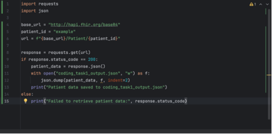
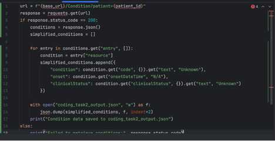
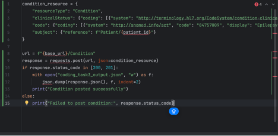
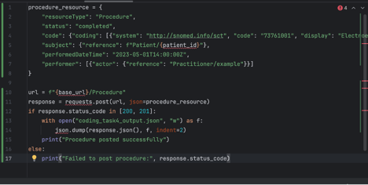
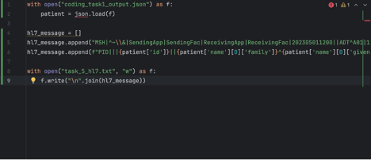

# ETL Pipeline Demonstration

[Home](./index.md) ·· [BPMN Model](./bpmn.md) ·· [ETL Pipeline](./etl_pipeline.md) ·· [Insights](./insights.md) ·· [Team Contributions](./team_contrib.md) ·· [About](./about.md)

## 1. Extraction – Connecting to a FHIR API to Retrieve Patient Data

To begin our ETL pipeline, we implemented a Python script using the `requests` library to connect to a public FHIR API endpoint and retrieve patient data. We targeted a specific patient ID ("example") hosted on the HAPI FHIR test server. This retrieval demonstrates how we extract structured health data in FHIR JSON format using a standard HTTP GET request.

We wrote the following code to perform this:

In this task, we have successfully extracted patient data and stored it locally. We included error handling by checking the HTTP response code, ensuring the pipeline remains robust against failures such as bad requests or unreachable servers.

## 2. Extraction – Using FHIR Search Parameters to Retrieve Patient Conditions

After extracting basic patient data, we retrieved the patient's medical conditions using FHIR search parameters. Specifically, we filtered `Condition` resources using the patient reference parameter `?patient=example`. This approach shows how FHIR APIs support efficient and fine-grained queries.

Here's how we implemented this step:

In this task, we parsed the nested FHIR structure to extract condition descriptions, onset times, and clinical statuses. We handled missing or inconsistent fields by using `get()` with defaults, ensuring downstream transformations remain consistent.

## 3. Loading – Posting Transformed Condition Data to the FHIR API

To demonstrate the "Load" phase, we transformed our extracted data into a new `Condition` resource and submitted it to the FHIR server via a POST request. This use case is representative of clinical documentation workflows where new diagnoses are entered.

We used the following script:

We have now posted a clinical `Condition` (Epilepsy) tied to our patient. The use of SNOMED CT ensures terminological standardization, and posting to the FHIR API showcases how systems can interoperate by exchanging semantically-rich data.

## 4. Loading – Posting a Procedure Resource with Practitioner Info

In this phase, we expanded the scenario by posting a `Procedure` resource. This time, the procedure included both patient and practitioner references, showing how FHIR allows relational modeling between care events and providers.

We used the following Python snippet:

This showcases a real-world scenario: recording a diagnostic procedure (EEG) tied to both a patient and a clinician. This step emphasizes the loading of actionable medical data into systems that can then notify downstream apps, analytics dashboards, or billing engines.

## 5. Interoperability – FHIR JSON to HL7 v2 Transformation

To support legacy interoperability, we demonstrated the conversion of a FHIR `Patient` resource (JSON) into an HL7 v2 text message. This conversion is crucial for health systems still using HL7 v2 messaging for lab, admission, discharge, and billing processes.

We performed the transformation with this code:

Here, we constructed two HL7 segments: MSH (Message Header) and PID (Patient Info). The conversion captures identifiers, names, dates, and gender. It supports messaging with older EHR systems or hospital networks that haven't transitioned to FHIR, making our data pipeline interoperable across generations.

## Why This Demonstration Matters for Interoperability

By walking through extraction, transformation, and loading with live FHIR data, and concluding with an HL7 v2 transformation, we've shown how modern health systems can serve as both producers and consumers of interoperable data. FHIR APIs allow modular access to patient data, clinical observations, and actions. The use of SNOMED CT codes ensures semantic alignment across systems. At the same time, converting FHIR to HL7 v2 ensures backward compatibility with legacy environments—making it possible for new digital tools (e.g., mobile apps or cloud EHRs) to interact with traditional hospital systems like LIS, RIS, or billing engines.